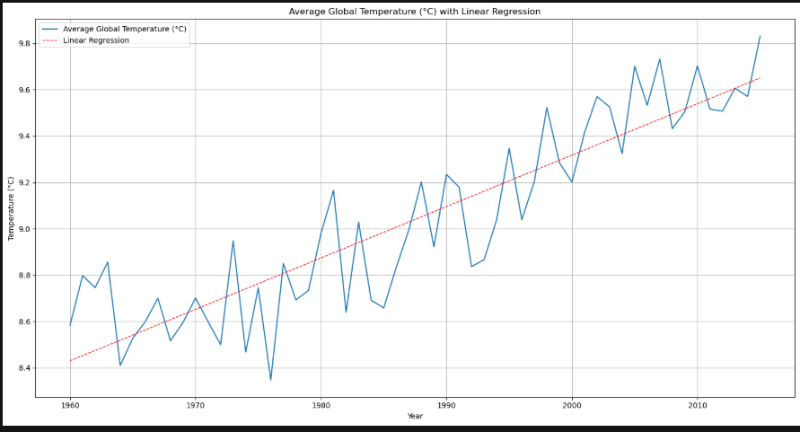
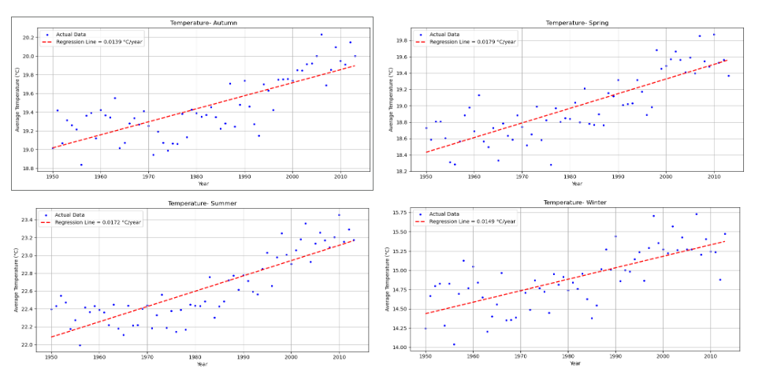
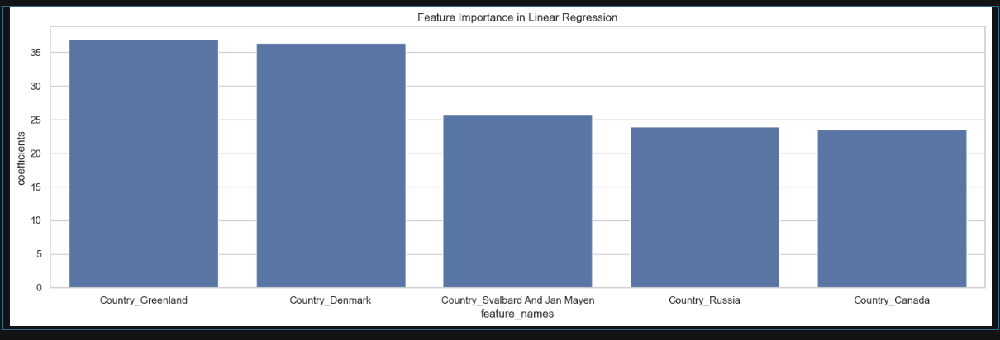

> Exploration, visualisation et prédiction des températures terrestres mondiales (1900–2013) à partir de données historiques — avec régression linéaire par pays et par saison.

---

## 📌 Contexte

Le réchauffement climatique est l'un des enjeux environnementaux les plus critiques de notre époque. Ce projet analyse l'évolution des températures terrestres mondiales sur plus d'un siècle, en combinant analyse exploratoire, visualisation et Machine Learning pour identifier des tendances significatives.

**Dataset :** Berkeley Earth Surface Temperature Dataset (~27 000 observations, 242 pays)

---

## 🎯 Objectifs

- Analyser l'évolution des températures mondiales depuis 1900
- Identifier les pays et régions les plus touchés par le réchauffement
- Modéliser les tendances par saison (hiver, printemps, été, automne)
- Prédire les températures moyennes par pays à l'aide d'une régression linéaire

---

## 📊 Données

| Fichier | Description |
|---------|-------------|
| `GlobalTemperatures.csv` | Températures terrestres et maritimes mondiales depuis 1750 |
| `GlobalLandTemperaturesByCountry.csv` | Températures moyennes par pays |
| `GlobalLandTemperaturesByMajorCity.csv` | Températures par grande ville |
| `GlobalLandTemperaturesByState.csv` | Températures par état/région |

---

## 🤖 Modèle de Machine Learning

### Régression Linéaire — Prédiction de température par pays

| Métrique | Valeur |
|----------|--------|
| **R² score (entraînement)** | **0.9977** |
| **R² score (test)** | **0.9974** |
| Features | Pays (OneHotEncoder), Année (StandardScaler) |
| Split | 80% train / 20% test |

> Un R² de 0.997 indique que le modèle explique 99,7% de la variance des températures — excellente performance pour un modèle de régression linéaire.

---

## 🔍 Résultats clés

- 📈 La température terrestre mondiale a augmenté d'environ **+1,5°C** entre 1960 et 2013
- ❄️ Les régions les plus affectées : **Groenland, Danemark, Svalbard** (coefficients les plus élevés du modèle)
- 🌿 La tendance au réchauffement est visible dans **toutes les saisons**, avec un effet plus marqué en hiver
- 📊 242 pays analysés sur plus d'un siècle de données

---

## 📈 Visualisations

### Évolution de la température mondiale (1960–2013)


### Tendances par saison — Hémisphère Nord


### Feature Importance — Régression par pays


---

## 📊 Dashboards Tableau

Deux dashboards interactifs ont été créés pour explorer les données :

- 🗺️ **Temperature & Emissions** — corrélation entre températures et émissions de CO₂
- 🏙️ **Températures par ville et saison** — comparaison des grandes villes mondiales

> *(Fichiers .twb disponibles dans le dépôt — à ouvrir avec Tableau Desktop ou Tableau Public)*

---

## 🛠️ Stack technique


---

## 📁 Structure du projet

```
global-temperature-analysis/
├── GlobalLandTemperatureByCountry.ipynb       ← ML : régression par pays
├── GlobalTemperatures_LinearRegression.ipynb  ← tendance mondiale + régression
├── Regression_Temperatures_season.ipynb       ← analyse par saison
├── Average_Temperatur_par_City_Season.twb     ← dashboard Tableau
├── Temperature_emissions_events.twb           ← dashboard Tableau CO₂
├── GlobalTemperatures.csv
├── GlobalLandTemperaturesByCountry.csv
├── GlobalLandTemperaturesByMajorCity.csv
├── GlobalLandTemperaturesByState.csv
└── README.md
```

---

## ▶️ Lancer le projet

```bash
git clone https://github.com/lilianaparadadiaz-data/global-temperature-analysis
cd global-temperature-analysis
pip install pandas numpy matplotlib seaborn scikit-learn jupyter
jupyter notebook
```

---

## 👩‍💻 Auteure

**Liliana Marcela Parada Díaz** — Data Analyst | Projet réalisé dans le cadre de la certification Jedha RNCP35288 (2025)

[](https://linkedin.com/in/lilianamarcelaparadadiaz)
[](https://github.com/lilianaparadadiaz-data)
